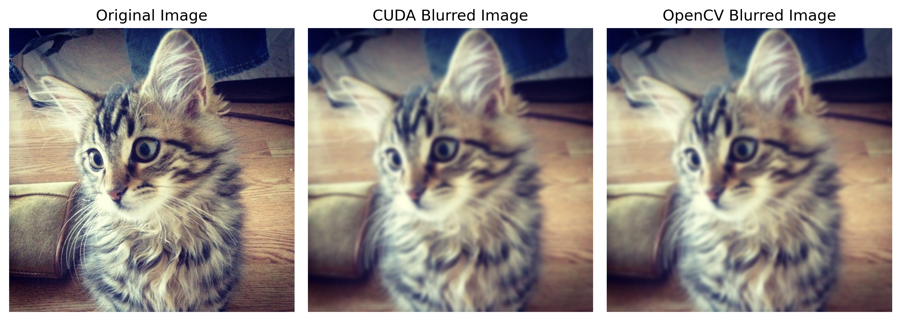

# 100 Days of GPU Challenge 🚀

Thanks to [Umar Jamil](https://github.com/hkproj/100-days-of-gpu) for organizing this challenge!

# Progress Log

## Day 1: Introduction to CUDA & Basic GPU Queries

**Key Learnings:**
- **CUDA Initialization & Device Query:**  
  Learned how to initialize the CUDA runtime and extract key GPU properties (e.g., GPU name, compute capability, SM count, warp size, global memory, and thread limits).

- **Basic Kernel Execution:**  
  Wrote and launched a minimal CUDA kernel to print a message from the GPU, confirming that my CUDA environment is set up correctly.

**GPU Query Example:**  
```c
cudaGetDevice(&deviceId);
cudaGetDeviceProperties(&props, deviceId);
printf("GPU Name: %s\n", props.name);
printf("Compute Capability: %d.%d\n", props.major, props.minor);
```

## Day 2: Vector Addition Acceleration

**Objective:**  
- Accelerate vector addition on a very large vector (size = \(10^8\)) using CUDA.
- Utilize multi-stream initialization for efficient data loading.
- Employ a strided approach to optimize memory access.
- Compare GPU performance with CPU performance.

**Key Learnings:**  
- **Memory Allocation:** How to allocate large arrays on the GPU using `cudaMalloc`.
- **Strided Memory Access:** Implementing kernels that process elements in a strided loop so that all threads contribute evenly.
- **CUDA Streams:** Overlapping initialization of multiple arrays concurrently using separate CUDA streams.
- **Performance Boost:** Observing a significant speed-up on the RTX A4000 compared to CPU execution.

**Vector Addition Kernel:**  
```c
__global__ void addVector(int *a, int *b, int *c)
{
    int t_ID = blockIdx.x * blockDim.x + threadIdx.x;
    int stride = gridDim.x * blockDim.x;

    if(t_ID < N)
    {
        for (int i = t_ID; i < N; i += stride)
        {
            c[i] = a[i] + b[i];
        }
    }
}
```


## Day 3: Matrix Multiplication Acceleration 

 **Objective:**  
 - Accelerate matrix multiplication for a square matrix of size \(N \times N\) (where \(N = 1000\)) using CUDA. 
 - Implement a 2D grid and block configuration tailored for matrix multiplication. 
 - Develop a GPU kernel to efficiently perform matrix multiplication in parallel.
 - Compare the performance of GPU-accelerated matrix multiplication against a CPU-based implementation. 

 **Key Learnings:**  
 - **2D Grid & Block Configuration for Matrices:** Understood how to design and configure 2D grids and blocks in CUDA to map effectively onto matrix dimensions. This configuration is crucial for parallelizing matrix operations, allowing different blocks and threads to work on different parts of the matrices concurrently.
 - **Efficient GPU Matrix Multiplication Kernel:** Implemented a highly parallel CUDA kernel, `matMulGPU`, specifically for matrix multiplication. This kernel utilizes a 2D thread structure to calculate elements of the output matrix in parallel, leveraging the GPU's massive computational power.
 - **Parallel Matrix Element Calculation:** Learned how to structure the `matMulGPU` kernel so that each thread computes a subset of elements in the result matrix `c`. The kernel employs nested loops and thread indexing to ensure that all necessary multiplication and addition operations are performed in a distributed and parallel manner across the GPU.
 - **Performance Speedup:** Observed a significant performance improvement when using the `matMulGPU` kernel compared to the traditional CPU-based matrix multiplication, demonstrating the effectiveness of GPU acceleration for computationally intensive matrix operations.

 **Matrix Multiplication Kernel:**  
 ```c 
 __global__ void matMulGPU(int *a, int *b, int *c)  
 {  
      int t_x = blockIdx.x * blockDim.x + threadIdx.x;  
      int t_y = blockIdx.y * blockDim.y + threadIdx.y;  

      int strideX = gridDim.x * blockDim.x;  
      int strideY = gridDim.y * blockDim.y + threadIdx.y;  

      int val = 0;  

      for (int  i = t_x; i < N; i += strideX)  
      {  
          for (int j = t_y; j < N; j += strideY)  
          {  
              for ( int k = 0; k < N; k++)  
              {  
                  val += a[i * N + k] * b[k * N + j];  
              }  
              c[i * N + j] = val;  
              val = 0;  
          }  
      }  
 }
```

## Day 4: CUDA Image Processing - RGB to Grayscale & Image Blurring

---

### Overview

1. **RGB to Grayscale Conversion:** Convert a color image to grayscale by applying a weighted sum on the RGB channels.
2. **Image Blurring:** Apply a box blur filter to a grayscale image by averaging neighboring pixel values.

Both tasks utilize 2D grid and block configurations for parallel processing and demonstrate CUDA memory management and kernel launching.

---

### Part 1: RGB to Grayscale Conversion

**Objective:**  
- Convert an RGB image to grayscale.
- Learn to manage multiple color channels and apply the weighted formula:  
  `Gray = 0.21 x Red + 0.71 x Green + 0.07 x Blue`
- Utilize CUDA kernels with 2D grid and block configurations to process each pixel in parallel.

**Key Learnings:**  
- Allocating device memory for both the RGB input and grayscale output.
- Configuring 2D grids/blocks (e.g., 32×32 threads) to cover the entire image.
- Transferring data between host and device efficiently.
- Integrating CUDA kernels with Python using shared libraries for easy invocation.

**RGB to Grayscale Kernel:**  
```c
__global__ void RGB2Grayscale(unsigned char *rgb_img_in, unsigned char *gray_img_out, int img_w, int img_h) 
{
    int t_x = blockIdx.x * blockDim.x + threadIdx.x;
    int t_y = blockIdx.y * blockDim.y + threadIdx.y;

    int strideX = gridDim.x * blockDim.x;
    int strideY = gridDim.y * blockDim.y;

    if(t_x < img_w && t_y < img_h)
    {
        for (int i = t_x; i < img_w; i += strideX)
        {
            for (int j = t_y; j < img_h; j += strideY)
            {
                int grayOffset = j * img_w + i;
                int rgbOffset = grayOffset * CHANNELS;

                unsigned char r = rgb_img_in[rgbOffset];
                unsigned char g = rgb_img_in[rgbOffset + 1];
                unsigned char b = rgb_img_in[rgbOffset + 2];

                gray_img_out[grayOffset] = 0.21f * r + 0.71f * g + 0.07f * b;
            }
        }
    }
}
```
### Part 2: Image Blurring

**Objective:**
- Apply a box blur filter to a grayscale image.
- Process each pixel by averaging values in a neighborhood defined by `BLUR_SIZE` (resulting in a window of size `2 x BLUR_SIZE + 1`).
- Use strided loops within the kernel to cover the entire image and handle boundary conditions.

**Key Learnings:**
- Processing pixel neighborhoods in parallel.
- Handling image boundaries by checking valid indices.
- Efficiently transferring data between host and device.

**Image Blurring Kernel:**
```c
__global__ void imageBlur(unsigned char *img_in, unsigned char *img_out, int img_w, int img_h)
{
    int t_x = blockIdx.x * blockDim.x + threadIdx.x;
    int t_y = blockIdx.y * blockDim.y + threadIdx.y;

    int strideX = gridDim.x * blockDim.x;
    int strideY = gridDim.y * blockDim.y;

    for (int i = t_x; i < img_w; i += strideX)
    {
        for (int j = t_y; j < img_h; j += strideY)
        {
            int pix_val = 0;
            int n_pixels = 0;

            for (int row = -BLUR_SIZE; row <= BLUR_SIZE; row++)
            {
                for (int col = -BLUR_SIZE; col <= BLUR_SIZE; col++)
                {
                    int cur_row = j + row;
                    int cur_col = i + col;

                    if (cur_row >= 0 && cur_row < img_h && cur_col >= 0 && cur_col < img_w)
                    {
                        pix_val += img_in[cur_row * img_w + cur_col];
                        n_pixels++;
                    }
                }
            }

            img_out[j * img_w + i] = (unsigned char)(pix_val / n_pixels);
        }
    }
}
```

## Day 5: GPU Accelerated Array Summation

**Objective:**
- **Random Array Initialization:** Using CUDA's `curand` library to populate an array with random integers.
- **Partial Reduction:** Summing array elements efficiently in parallel using shared memory.
- **Performance Benchmarking:** Comparing GPU performance against a CPU summation.

Managed memory is used to simplify data handling between the host and device, and CUDA events are utilized for precise timing of the GPU kernel execution.

**Key Learnings:**
- **CUDA Random Number Generation:** Learnt how to initialize random states with `curand_init` and generate random numbers using `curand`.

- **Partial Reduction:** Implemented a reduction algorithm using shared memory and synchronization to sum large arrays efficiently.

- **Performance Benchmarking:** Measured and compared GPU and CPU execution times to highlight the benefits of parallel processing.

- **Memory Management:** Utilized CUDA Unified Memory for easier host-device data management.

**Partial Sum Kernel:**
```c
__global__ void calcSum(int *arr_in, int *arr_out, int N)
{   
    __shared__ int mem[2048];

    int next_i = blockDim.x * blockIdx.x * 2 + threadIdx.x;

    if (next_i < N) 
    {
        if (next_i + blockDim.x < N) 
        {
            mem[threadIdx.x] = arr_in[next_i] + arr_in[next_i + blockDim.x];
        } 
        else 
        {
            mem[threadIdx.x] = arr_in[next_i];
        }
    } 
    else 
    {
        mem[threadIdx.x] = 0;
    }
    __syncthreads();

    for(int stride = blockDim.x / 2; stride > 0; stride /= 2)
    {
        if(threadIdx.x < stride)
        {
            mem[threadIdx.x] += mem[threadIdx.x + stride];
        }
        __syncthreads();
    }

    if (threadIdx.x == 0)
    {
        arr_out[blockIdx.x] = mem[0];
    }
}
```

**Results:**
- **Execution Time on CPU -** 3.859000 ms
- **Execution Time on GPU -** 0.831488 ms


## Day 6: GPU Accelerated Matrix Multiplication with Tiling

**Objective:**
- **Random Matrix Initialization:** Use CUDA's `curand` library to populate two matrices with random integers.
- **Matrix Multiplication:** Multiply matrices in parallel on the GPU using:
  - A straightforward (naive) GPU kernel.
  - An optimized tiled GPU kernel that leverages shared memory.
- **CPU Multiplication:** Perform matrix multiplication on the CPU for performance comparison.
- **Performance Benchmarking:** Compare CPU execution time against GPU and tiled GPU execution times.

Managed memory is used to simplify data handling between the host and device, and CUDA streams are employed for concurrent matrix initialization.

**Key Learnings:**
- **CUDA Random Number Generation:** Learned how to initialize random states with `curand_init` and generate random numbers using `curand`.
- **Matrix Multiplication on GPU:** Implemented both naive and tiled matrix multiplication kernels.
- **Tiling Optimization:** Utilized shared memory to reduce global memory access and enhance performance.
- **Performance Benchmarking:** Measured and compared CPU vs GPU performance for large-scale matrix multiplication.
- **Memory Management:** Leveraged CUDA Unified Memory for streamlined host-device data management.

**Tiled Matrix Multiplication Kernel:**
```c
__global__ void matMulTiled(int *a, int *b, int *c)
{
    __shared__ int mem_a[MEM][MEM];
    __shared__ int mem_b[MEM][MEM];

    int t_x = threadIdx.x;
    int t_y = threadIdx.y;

    int b_x = blockIdx.x;
    int b_y = blockIdx.y;

    int row = b_y * MEM + t_y;
    int col = b_x * MEM + t_x;

    int val = 0;

    for(int stride = 0; stride < ceil((float)N/MEM); stride++)
    {
        if ((row < N) && ((stride * MEM + t_x) < N))
        {
            mem_a[t_y][t_x] = a[row * N + stride * MEM + t_x];
        }
        else
        {
            mem_a[t_y][t_x] = 0;
        }
        if ((col < N) && ((stride * MEM + t_y) < N))
        {
            mem_b[t_y][t_x] = b[(stride * MEM + t_y) * N + col];
        }
        else
        {
            mem_b[t_y][t_x] = 0;
        }
        __syncthreads();

        for(int k = 0; k < MEM; k++)
        {
            val += mem_a[t_y][k] * mem_b[k][t_x];
        }
        __syncthreads();
    }
    c[row * N + col] = val;
}
```

**Results:**
- **Execution Time on CPU -** 51694.223000 ms
- **Execution Time on GPU -** 675.109863 ms
- **Execution Time on GPU for a Tiled approach -** 277.286774 ms


## Day 7: GPU Accelerated Gaussian Blur with PyCUDA

**Objective:**
- **Gaussian Blur Kernel:** Developed a CUDA kernel for applying Gaussian blur to RGB images.
- **PyCUDA Integration:** Learned to use PyCUDA for kernel invocation and managing GPU memory.
- **Comparison with OpenCV:** Compared the results of the custom CUDA kernel with OpenCV's built-in Gaussian blur function.

The kernel applies a Gaussian filter to each pixel of an RGB image by computing a weighted average over a neighborhood defined by the blur radius and sigma (variance). The implementation uses PyCUDA to load the compiled PTX module and execute the kernel.

**Key Learnings:**
- **CUDA Kernel Development:** Wrote a kernel to perform Gaussian blur on RGB images, handling boundary conditions and computing the Gaussian weights.
- **PyCUDA Usage:** Learned how to allocate GPU memory, copy data to/from the device, and launch kernels using PyCUDA.
- **Image Processing Comparison:** Verified the custom kernel’s performance and output by comparing it with OpenCV's Gaussian blur implementation.

**Gaussian Blur Kernel:**
```c
extern "C" __global__ void imageBlur(unsigned char *img_in, unsigned char *img_out, int img_w, int img_h, int blur_radius, int sigma)
{
    int t_x = blockIdx.x * blockDim.x + threadIdx.x;
    int t_y = blockIdx.y * blockDim.y + threadIdx.y;

    if ( t_x < img_w && t_y < img_h)
    {
        float r = 0.0f;
        float g = 0.0f;
        float b = 0.0f;
        float val = 0.0f;

        for(int row = -blur_radius; row <= blur_radius; row++)
        {
            for(int col = -blur_radius; col <= blur_radius; col++)
            {
                int cur_row = t_y + row;
                int cur_col = t_x + col;

                if(cur_row < img_h && cur_row >= 0 && cur_col < img_w && cur_col >= 0)
                {
                    float gauss = expf(-(row * row + col * col) / (2.0 * sigma * sigma));

                    int channel = (cur_row * img_w + cur_col) * 3;
                    r += gauss * img_in[channel];
                    g += gauss * img_in[channel + 1];
                    b += gauss * img_in[channel + 2];

                    val += gauss;
                }
            }
        }

        int n = (t_y * img_w + t_x) * 3;
        img_out[n]   = (unsigned char)(roundf(r / val));
        img_out[n+1] = (unsigned char)(roundf(g / val));
        img_out[n+2] = (unsigned char)(roundf(b / val));
    }
}
```

**Results:**


## Day 8: GPU Accelerated 2D Convolution with He Normal Initialization

**Objective:**
- **2D Convolution Kernel:** Developed a CUDA kernel to perform 2D convolution on an input matrix with a given filter.
- **He Normal Initialization:** Initialized filter weights using He Normal Initialization for better weight distribution.
- **Performance Benchmarking:** Measured and compared GPU and CPU execution times for convolution.

The 2D convolution kernel applies a filter over the input data with boundary checking, while the filter weights are initialized using a He Normal distribution. Additionally, a verification kernel is used to compare the GPU results with the CPU implementation.

**Key Learnings:**
- **2D Convolution in CUDA:** Implemented a convolution kernel with nested loops and boundary conditions.
- **He Normal Initialization:** Utilized CUDA's random number generation to initialize filter weights based on the He Normal method.
- **Performance Measurement:** Employed CUDA events to time the GPU kernel and compared it to a CPU version.
- **Result Verification:** Counted mismatches between GPU and CPU results using atomic operations.

---

**GPU Convolution Kernel:**
```c
__global__ void conv2D(float *input, float *output, float *filter, int radius, int N) {
    int row = blockIdx.y * blockDim.y + threadIdx.y;
    int col = blockIdx.x * blockDim.x + threadIdx.x;

    if (row < N && col < N) {
        float val = 0.0f;
        int f_size = 2 * radius + 1;

        for (int row_f = 0; row_f < f_size; row_f++) {
            for (int col_f = 0; col_f < f_size; col_f++) {
                int cur_row = row - radius + row_f;
                int cur_col = col - radius + col_f;

                if (cur_row >= 0 && cur_row < N && cur_col >= 0 && cur_col < N) {
                    val += filter[row_f * f_size + col_f] * input[cur_row * N + cur_col]; 
                }
            }
        }
        output[row * N + col] = val;
    }
}
```

**Results:**
- **Execution Time on CPU -** 0.68 ms
- **Execution Time on GPU -** 0.01 ms


## Day 9: Laplacian Edge Detection with PyCUDA

**Objective:**
- **Revisit Day 4 Techniques:** Recalled and applied the grayscale conversion and image blurring methods learned on Day 4.
- **Edge Detection:** Developed a 2D convolutional kernel that applies a Laplacian filter to the blurred image for edge detection.
- **PyCUDA Integration:** Leveraged PyCUDA for GPU memory management, kernel execution, and data transfer, streamlining the overall workflow.

**Key Learnings:**
- **Grayscale Conversion & Blurring (Day 4 Revisited):**  
  - Converted an RGB image to grayscale using a custom kernel.
  - Applied image blurring to smooth out noise, which helps prevent the edge detection filter from capturing unwanted details.
  
- **2D Convolution & Laplacian Edge Detection:**  
  - Developed a 2D convolution kernel that applies a Laplacian filter to the blurred image.
  - This filter highlights edges by calculating second-order derivatives across the image.
  
- **PyCUDA Usage:**  
  - Managed GPU memory allocation and data transfers.
  - Loaded and invoked CUDA kernels from precompiled PTX modules.
  - Set appropriate grid and block dimensions based on the image size.
  - Enabled rapid experimentation and integration of custom CUDA kernels with Python.

**Workflow Overview:**
1. **Grayscale Conversion:** The RGB image is first converted to grayscale, simplifying the data for subsequent processing.
   
2. **Image Blurring:** The grayscale image is blurred using a custom kernel to reduce noise. This ensures that the edge detection step focuses on significant edges rather than spurious details.
   
3. **Data Type Conversion:** The blurred image is converted from integer to float format to prepare it for convolution operations.
   
4. **Laplacian Edge Detection:** A custom 2D convolution kernel applies a Laplacian filter to the blurred, float-converted image. This kernel computes the weighted sum of neighboring pixels to emphasize regions with high intensity changes (edges).
   
5. **Visualization:** The processed images (grayscale, blurred, and edge-detected) are transferred back to the host and displayed using Matplotlib, allowing for side-by-side comparison of the results.

This approach demonstrates how foundational techniques from previous days can be integrated and extended using PyCUDA to build a robust GPU-accelerated image processing pipeline.

**Laplacian Filter and Edge Detection Kernel**
```C
laplacian_filter = np.array([0, 1, 0,
                             1, -4, 1,
                             0, 1, 0],
                             dtype=np.float32).flatten()
```

```C
extern "C" __global__ void edgeDetectionLaplacianConv2D(float *input, float *output, float *filter, int img_w, int img_h) 
{
    int row = blockIdx.y * blockDim.y + threadIdx.y;
    int col = blockIdx.x * blockDim.x + threadIdx.x;

    if(row < img_h && col < img_w) 
    {
        int radius = 1;
        float val = 0.0f;
        int f_size = 2 * radius + 1;

        for(int row_f = 0; row_f < f_size; row_f++) 
        {
            for(int col_f = 0; col_f < f_size; col_f++) 
            {
                int cur_row = row - radius + row_f;
                int cur_col = col - radius + col_f;

                if(cur_row >=0 && cur_row < img_h && cur_col >= 0 && cur_col < img_w) 
                {
                    val += filter[row_f * f_size + col_f] * input[cur_row * img_w + cur_col]; 
                }
            }
        }
        output[row * img_w + col] = val;
    }
}
```

**Results:**


### **Day 10**
- Implemented a tiled convolutional kernels which handles cases where the input and output sizes of matrices does not match.
- Understood the concept of halo cells and shared memory.
- Results:
  - GPU Tiled Convolution Execution Time: 0.07 ms
  - CPU Tiled Convolution Execution Time: 0.66 ms

 ### **Day 11**
 - Learned about 3D arrays and how they are stored in the memory.
 - Implemented a simple stencil sweep kernel.
 - Results:
   - GPU time: 36.248322 ms
   - CPU time: 201.901993 ms

 ### **Day 12**
 - Implemented a tiled stencil sweep kernel.
 - Results for N = 256:
   - GPU time: 36.248322 ms
   - Tiled GPU time 18.025248 ms
   - CPU time: 201.901993 ms

 ### **Day 13**
 - Implemented a thread coarsed stencil sweep kernel.
 - Results for N = 256:
   - GPU time: 36.248322 ms
   - Tiled GPU time 18.025248 ms
   - Thread Coarsed GPU time: 7.199744 ms
   - CPU time: 201.901993 ms
