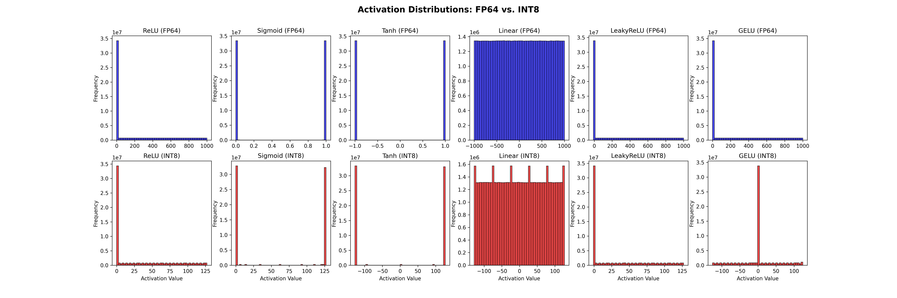

# Day 26: Precision Analysis of Activation Functions - FP64, FP32, FP16, and INT8 Performance

**Objective:**
- **Analyze Performance Across Precisions:** Investigate the performance of various activation functions (ReLU, Sigmoid, Tanh, Linear, LeakyReLU, GELU) when implemented using different numerical precisions: double-precision floating-point (FP64), single-precision floating-point (FP32), half-precision floating-point (FP16), and 8-bit integer (INT8).
- **Evaluate Numerical Range Impact:** Analyze how the numerical range and output distribution of these activation functions are affected by reduced precision, particularly when using FP16 and INT8 compared to FP32 and FP64.
- **Performance vs. Precision Trade-off:**  Benchmark and compare the execution times and GFLOPS achieved for each activation function and precision combination to understand the performance gains offered by lower precision data types and the potential trade-offs in numerical accuracy and range.
- **Visualize Output Distributions:** Generate and analyze histograms of the FP64 and INT8 outputs for ReLU and Sigmoid activation functions using matplotlib (Python) to visually inspect the impact of reduced precision on output distributions.

**Key Learnings:**
- **Performance Benefits of Reduced Precision:** Observed significant performance improvements (higher GFLOPS and lower execution times) when using lower precision data types like FP16 and INT8 compared to FP32 and FP64 for all tested activation functions. This highlights the computational efficiency gains achievable by moving to lower precision in GPU computing, especially for neural network operations.
- **Precision Trade-offs for Activation Functions:**  Understood that reducing precision can affect the numerical range and granularity of activation function outputs. While FP64 and FP32 offer a wide dynamic range and high precision, FP16 and INT8 represent numbers with lower precision and potentially a narrower range. This trade-off needs to be carefully considered based on the application's sensitivity to numerical accuracy.
- **INT8 Range Limitations:** Noted that INT8, due to its limited 8-bit representation, has a constrained numerical range (e.g., -128 to 127 for signed INT8).  For activation functions like Sigmoid and Tanh, which have outputs naturally bounded within [0, 1] and [-1, 1] respectively, INT8 representation after proper scaling can be effective. However, for unbounded functions like ReLU or Linear, direct INT8 representation might require careful consideration of potential overflow and quantization effects.
- **Data Type Specific Implementations:** Implemented separate CUDA kernels for each activation function tailored to each data type (FP64, FP32, FP16, INT8). This demonstrated the need to handle data type conversions and intrinsic functions appropriately when working with mixed precision or lower precision compute on GPUs. For example, using CUDA's `cuda_fp16.h` header and functions like `__float2half_rn`, `__half2float`, and half-precision comparison intrinsics (`__hge`).
- **Visualization for Precision Analysis:**  Used matplotlib to visualize the output distributions of FP64 and INT8 for ReLU and Sigmoid. These plots provide a visual confirmation of how the output range and distribution are affected by reduced precision and quantization in INT8, especially for functions with continuous output ranges in higher precisions.

**Code Implementation Details:**

- **Initialization Kernels (`init`, `init_int8`):**  CUDA kernels `init` and `init_int8` are used to initialize input vectors on the GPU with random values for different data types (FP64, FP32, FP16, INT8). The `init` kernel initializes floating-point types with values in the range [-1000, 1000], while `init_int8` initializes INT8 vectors with values in the range [-128, 127].
- **Activation Function Kernels (`ReLU_*`, `sigmoid_*`, `tanh_*`, `linear_*`, `leakyrelu_*`, `gelu_*`):**  Separate CUDA kernels are implemented for each activation function (ReLU, Sigmoid, Tanh, Linear, LeakyReLU, GELU) and for each data type (FP64, FP32, FP16, INT8). These kernels perform element-wise activation function computations on the input vectors.  For FP16, CUDA's half-precision intrinsics are used. For INT8, outputs are often scaled or quantized to fit within the INT8 range where applicable (like in Sigmoid, Tanh and GELU INT8 implementations).
- **Range Computation Functions (`compute_range_*`):** CPU-side functions `compute_range_double`, `compute_range_float`, `compute_range_half`, and `compute_range_int8` are used to calculate the minimum and maximum values in the output vectors for each data type.
- **Performance Measurement:** CUDA events are used to accurately measure the execution time of each kernel, and GFLOPS are calculated based on the vector size (N) and execution time.
- **Output File Saving:** The code includes saving the FP64 and INT8 outputs of ReLU, Sigmoid, Tanh, Linear, LeakyReLU, and GELU to binary files (`.bin`) for further analysis or visualization (as demonstrated using matplotlib in Python).

**Visualization Insights :** The plots comparing FP64 and INT8 output distributions for ReLU and Sigmoid visually reinforce the numerical range and precision differences.  FP64 outputs exhibit a continuous distribution, while INT8 outputs show a clear step-like, quantized distribution due to the limited number of representable values in 8-bit integers.

**Results (for N=2^26):**

**ReLU FP64:** Time = 49.63 ms, GFLOPS = 1.35, Range = [0.00, 1000.00]

**ReLU FP32:** Time = 25.69 ms, GFLOPS = 2.61, Range = [0.00, 1000.00]

**ReLU FP16:** Time = 15.39 ms, GFLOPS = 4.36, Range = [0.00, 1000.00]

**ReLU INT8:** Time = 8.97 ms,  GFLOPS = 7.48, Range = [0, 127]

**Sigmoid FP64:** Time = 53.37 ms, GFLOPS = 1.26, Range = [0.00, 1.00]

**Sigmoid FP32:** Time = 25.76 ms, GFLOPS = 2.60, Range = [0.00, 1.00]

**Sigmoid FP16:** Time = 16.60 ms, GFLOPS = 4.04, Range = [0.00, 1.00]

**Sigmoid INT8:** Time = 11.20 ms, GFLOPS = 5.99, Range = [0, 127]

**Tanh FP64:** Time = 53.21 ms, GFLOPS = 1.26, Range = [-1.00, 1.00]

**Tanh FP32:** Time = 26.52 ms, GFLOPS = 2.53, Range = [-1.00, 1.00]

**Tanh FP16:** Time = 15.32 ms, GFLOPS = 4.38, Range = [-1.00, 1.00]

**Tanh INT8:** Time = 8.94 ms,  GFLOPS = 7.50, Range = [-127, 127]

**Linear FP64:** Time = 2.24 ms,  GFLOPS = 30.02, Range = [-1000.00, 1000.00]

**Linear FP32:** Time = 2.33 ms,  GFLOPS = 28.78, Range = [-1000.00, 1000.00]

**Linear FP16:** Time = 2.20 ms,  GFLOPS = 30.48, Range = [-1000.00, 1000.00]

**Linear INT8:** Time = 2.19 ms,  GFLOPS = 30.68, Range = [-128, 127]

**LeakyReLU FP64:** Time = 54.84 ms, GFLOPS = 1.22, Range = [-10.00, 1000.00]

**LeakyReLU FP32:** Time = 26.66 ms, GFLOPS = 2.52, Range = [-10.00, 1000.00]

**LeakyReLU FP16:** Time = 14.19 ms, GFLOPS = 4.73, Range = [-10.00, 1000.00]

**LeakyReLU INT8:** Time = 8.46 ms,  GFLOPS = 7.93, Range = [-1, 127]

**GELU FP64:** Time = 51.87 ms, GFLOPS = 1.29, Range = [-0.17, 1000.00]

**GELU FP32:** Time = 26.56 ms, GFLOPS = 2.53, Range = [-0.17, 1000.00]

**GELU FP16:** Time = 15.25 ms, GFLOPS = 4.40, Range = [-0.17, 1000.00]

**GELU INT8:** Time = 8.98 ms,  GFLOPS = 7.48, Range = [-126, 124]

**Results Analysis:**
- **Performance Scaling with Precision:**  As precision decreases from FP64 to INT8, the execution time consistently reduces, and GFLOPS increases for all activation functions.  Significant speedups are observed with FP16 and INT8 compared to FP32 and especially FP64. For computationally intensive functions like Sigmoid, Tanh, and GELU, the speedup from FP64 to INT8 is substantial (approximately 5-6x faster in terms of time, and correspondingly higher GFLOPS).  Linear activation, being a simple pass-through, already exhibits high GFLOPS even in FP64, and the gains in lower precision are less dramatic in percentage terms but still present in absolute time.
- **Numerical Range and INT8 Representation:**
    - **ReLU, LeakyReLU:** INT8 ReLU and LeakyReLU outputs are clamped to the [0, 127] and [-1, 127] ranges respectively, due to the nature of INT8 representation and the implementation. While functional, the reduced range and quantization effects compared to floating-point versions need to be considered.
    - **Sigmoid, Tanh, GELU:**  For Sigmoid and Tanh, the output ranges are naturally bounded ([0, 1] and [-1, 1]). When converting to INT8, the output range is effectively mapped and quantized to [0, 127] or a similar INT8 range. GELU INT8 outputs are also bounded within the approximate INT8 range. The distribution plots (generated by `day26_plot_distribution.py` – see below) visually demonstrate the quantization effect of INT8, showing discrete levels compared to the continuous distributions in FP64.
    - **Linear:** Linear activation, ideally, should preserve the input range. However, INT8 Linear also clamps output to the INT8 range, which might be acceptable if the subsequent layers or operations are designed to work with this limited range.

**Conclusion:**
- Using lower precision data types like FP16 and INT8 offers significant performance advantages for activation function computations on GPUs, leading to faster execution and higher throughput.  The choice of precision involves a trade-off with numerical accuracy and range.
- For applications where high numerical precision is critical, FP32 or FP64 might be necessary. However, for many deep learning inference tasks, FP16 or even INT8 can provide acceptable accuracy with substantial performance and memory benefits.
- INT8, while offering the highest performance, has a limited numerical range and introduces quantization. Careful scaling, quantization-aware training, or other techniques are often needed to effectively deploy INT8 neural networks, especially for more complex models.
- FP16 represents a good balance between performance and precision, often providing near-FP32 accuracy with significantly improved performance and reduced memory footprint compared to FP32, making it a popular choice for deep learning on GPUs.
