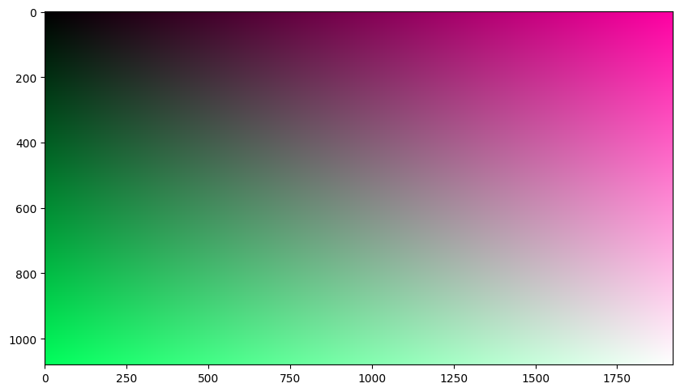

# Day 34: Image Rendering on the GPU: A Gradient Example

**Objective:**
- **Explore Basic Image Rendering Concepts:**  Introduce the fundamental ideas behind image rendering, particularly how to calculate and assign colors to pixels to create an image.
- **Conceptual CUDA Rendering Kernel:** Implement a simple CUDA kernel that demonstrates the process of determining pixel colors programmatically based on their position in the image grid. This is a rudimentary example of how rendering can be performed on the GPU.
- **Visualize Programmatically Rendered Images:** Use a plotting library to display the image generated by our GPU rendering kernel, visualizing the result of our pixel color calculations.

**Key Learnings:**
- **Fundamentals of Image Rendering:**
    - **Pixel Grid:** Learned that digital images are fundamentally grids of pixels, and rendering involves determining the color for each pixel in this grid.
    - **Pixel Coordinates:** Understood that each pixel has a position, typically defined by row and column indices. These coordinates are crucial for calculating pixel properties like color.
    - **Color Channels (RGB):** Introduced to the concept of RGB color representation, where each pixel's color is defined by the intensity of Red, Green, and Blue components. Each component is often represented as a numerical value (e.g., a float between 0 and 1, or an integer in the range 0-255).
    - **Programmatic Color Calculation:**  Discovered that pixel colors can be calculated algorithmically, based on pixel coordinates or other parameters. This is the basis of computer graphics rendering, where algorithms define how light and surfaces interact to determine pixel colors.
- **Conceptual CUDA Rendering Kernel (`render` kernel):**
    - **Parallel Pixel Processing:** Understood that GPUs are well-suited for image rendering because each pixel's color can often be calculated independently and in parallel. Our CUDA kernel exemplifies this by assigning a thread to calculate the color of each pixel (or a small group of pixels).
    - **Kernel Logic: Coordinate-Based Color:**  Examined a simple rendering kernel that calculates color based directly on pixel row and column indices:
        - **Red Channel:** Color intensity increases as we move across columns (horizontally).
        - **Green Channel:** Color intensity increases as we move down rows (vertically).
        - **Blue Channel:** Color intensity is based on the sum of row and column positions, creating a diagonal gradient effect.
    - **Output Image as a Pixel Array:** Learned that the output of the rendering process is essentially an array of pixel color values, which can then be interpreted as an image.
    - **Linear Pixel Data Representation:** Noted that pixel data is often stored linearly in memory. For RGB images, a common format is to store the Red, Green, and Blue components of each pixel consecutively, row by row.

**Code Implementation - Conceptual Overview:**

- **Rendering Function (Kernel):**
    -  The `render` function (implemented as a CUDA kernel) is the core of our rendering process.
    - **Pixel Position:** It determines the 2D position (row and column) for each pixel it needs to calculate, based on how it is launched in parallel on the GPU.
    - **Color Calculation:** For each pixel, it computes Red, Green, and Blue color values using simple formulas based on the pixel's row and column index. These formulas define the visual pattern of our rendered image (in this case, a gradient).
    - **Storing Pixel Color:** It stores the calculated RGB color values into an output data array, representing the final rendered image.
- **Image Display:**
    - After the GPU rendering function completes, the resulting pixel data (a linear array of RGB values) is restructured into a 2D image format suitable for display.
    - A plotting library is used to take this pixel data and display it as a visual image on the screen.

**Illustrative Example:**

- **Gradient Image:** The provided code renders a simple gradient image. When executed, you'll see an image where colors smoothly change:
    - Horizontally, from left to right, the red component increases.
    - Vertically, from top to bottom, the green component increases.
    - Diagonally, the blue component changes based on the sum of horizontal and vertical position.

  

**Conceptual Conclusion -  GPU-Based Image Generation:**
- **Basic Image Rendering Demonstrated:** Successfully created a simple image programmatically using a GPU-based function (kernel). This demonstrates the fundamental principle of controlling pixel colors to generate images.
- **Parallelism in Rendering:** Understood conceptually how GPUs can accelerate rendering by processing many pixels simultaneously. Each pixel's color calculation can be done independently, making it ideal for parallel execution.
- **Foundation for Graphics and Ray Tracing:** This simple example provides a basic conceptual foundation for understanding more complex graphics rendering techniques, including ray tracing. Ray tracing, in essence, is also about calculating pixel colors, but using more sophisticated algorithms that simulate how light rays interact with a virtual 3D scene. This example shows the starting point: defining pixel colors based on a program. From here, you can move towards more complex color determination based on simulated physics and scene properties.