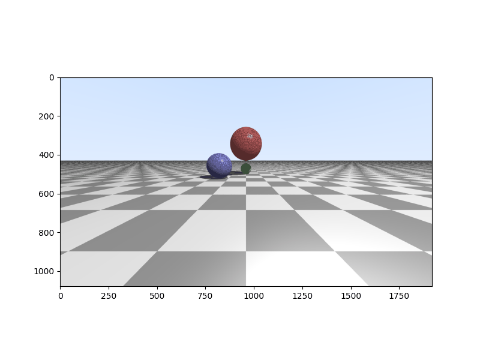

# Day 37: Extending the Ray Tracer: Multiple Objects, Shading, and Shadows

**Objective:**
- **Render a Complex Scene:** Develop a PyCUDA program that utilizes a custom CUDA kernel to ray trace a scene containing multiple objects, including spheres and a plane.
- **Implement Realistic Shading:** Incorporate diffuse and specular lighting models to achieve more visually appealing surface rendering.
- **Enable Shadows:** Implement shadow casting to add depth and realism to the rendered scene by determining if objects are occluded from the light source.
- **Utilize a Flexible Camera Model:** Set up a virtual camera with control over its position, orientation, and field of view to frame the scene effectively.

**Key Learnings:**
- **Rendering Multiple Scene Elements:** Learned how to extend the ray tracing algorithm to handle a variety of geometric primitives within a single scene, specifically spheres and a plane. This involves implementing intersection tests for each object type and determining the closest intersection along a ray.
- **Advanced Lighting and Shading:**
    - **Diffuse Reflection:** Implemented the Lambertian diffuse lighting model, which calculates the brightness of a surface based on the angle between the surface normal and the direction of the light source.
    - **Specular Reflection:** Added specular highlights to simulate the reflection of light from shiny surfaces, making the rendered objects appear more realistic.
- **Shadow Generation:** Implemented shadow casting by tracing secondary rays from the intersection point towards the light source to check for occluding objects. This adds significant depth and visual accuracy to the rendering.
- **Camera Control:** Gained experience in setting up a virtual camera with parameters such as position, the point it's looking at, and an up direction. This allows for flexible framing and viewing of the 3D scene.
- **Vector Algebra in Rendering:** Utilized vector algebra extensively for calculations involving ray directions, surface normals, light directions, and reflections, reinforcing the importance of these mathematical concepts in computer graphics.
- **Modular CUDA Kernel Design:** Employed CUDA device functions to encapsulate reusable logic, such as vector operations and intersection tests, leading to a more organized and maintainable kernel structure.

**Code Implementation Details:**

- **CUDA Kernel (`GPUkernel` string):**
    - **Helper Functions (`__device__`)**: Includes functions for dot product (`dot`), vector normalization (`normalize`), reflection calculation (`reflect`), and linear interpolation (`mix`). These are essential for various ray tracing calculations.
    - **Intersection Functions (`__device__`)**: Implements `intersect_sphere` to determine ray-sphere intersections and `intersect_plane` for ray-plane intersections. Both functions return whether an intersection occurred and the distance (`t_hit`) to the intersection point.
    - **Scene Definition (`__global__ void render(...)`)**: Defines the parameters for three spheres (position, radius, color), with the first sphere's horizontal position oscillating over time. It also defines the floor plane using its normal and distance from the origin, along with a function (`floor_pattern`) to create a checkered pattern. The position of the light source and the ambient light color are also defined.
    - **Camera Setup (`__global__ void render(...)`)**: Sets up the virtual camera's position, the point it's looking at, and the up direction. It then calculates the camera's orientation vectors (direction, right, up) and uses these to generate the direction of the ray for each pixel on the virtual screen, taking into account the aspect ratio and focal length.
    - **Ray Casting and Shading (`__global__ void render(...)`)**: For each pixel, a primary ray is cast from the camera. The kernel then iterates through the scene objects to find the closest intersection. If an intersection is found, the surface normal is calculated. The color of the hit point is determined by calculating diffuse and specular lighting components based on the light source and the surface properties. Shadow rays are cast to check if the point is occluded from the light. If no object is hit, a simple sky color is returned.
    - **Gamma Correction**: Applies a gamma correction of 1/2.2 to the final color to ensure a more perceptually accurate image.
    - **Output**: The calculated RGB color for each pixel is written to the output display array (`disp`).

**Output:**
- Running the corresponding Python script will generate an animation (if the `time` variable is varied) of the scene rendered using the ray tracing algorithm implemented in the CUDA kernel. The animation, saved as `intersection.gif` in the same directory as this README, showcases the animated sphere moving while the other spheres and the checkered plane remain static, all with diffuse and specular lighting and shadows.

