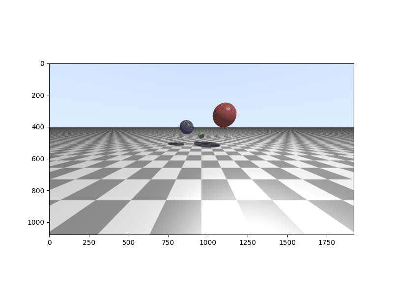

# Day 38: Implementing Basic Physics in a GPU Ray Tracer

**Objective:**
- **Integrate Physics Simulation:** Enhance the ray tracer from Day 37 by adding a basic physics simulation to the scene, making the spheres interact dynamically.
- **Implement Collision Detection and Response:** Develop CUDA code to detect collisions between spheres and between spheres and the ground, and implement simple responses to these collisions.
- **Simulate Gravity:** Introduce a basic gravitational force to make the spheres fall and bounce realistically.
- **Constrain Objects within Boundaries:** Implement boundary conditions to keep the simulated spheres within the visible rendering area.

**Key Learnings:**
- **Basic Physics Simulation:**
    - **Gravity:** Learned how to simulate a constant gravitational force affecting the vertical velocity of the spheres.
    - **Velocity and Position Updates:** Understood how to update the position of objects based on their velocity and a time step.
- **Collision Detection:**
    - **Sphere-Floor Collision:** Implemented a check to detect when a sphere intersects the floor and applied a simple bouncing effect.
    - **Sphere-Sphere Collision:** Developed a method to detect collisions between pairs of spheres by checking if the distance between their centers is less than the sum of their radii.
- **Collision Response:**
    - **Impulse-Based Collision Response:** Implemented a basic impulse-based response to sphere-sphere collisions, affecting the velocities of the colliding spheres to simulate a bounce. This involves calculating the collision normal and applying an impulse proportional to the relative velocity along the normal.
    - **Coefficient of Restitution:** Introduced a coefficient of restitution (implicitly 0.8 for floor and 1.8 for sphere-sphere) to control the bounciness of the collisions.
- **Boundary Conditions:** Implemented simple boundary checks to reverse the velocity of spheres when they hit the edges of the scene, keeping them contained.
- **Integrating Physics with Rendering:** Learned how to run a physics simulation for a number of time steps within the rendering loop to update the positions of the objects before ray tracing the scene, creating an animation of the physical interactions.

**Code Implementation Details:**

- **CUDA Kernel (`GPUkernel` string):**
    - **`collision` Device Function:** This new device function encapsulates the entire physics simulation logic. It takes the current positions and velocities of the three spheres, their radii, the time step, and the current simulation time as input.
        - **Gravity Simulation:** Applies a downward acceleration to the vertical velocity of each sphere to simulate gravity.
        - **Floor Collision:** Checks if any sphere has collided with the floor (y-position less than its radius). If so, it reflects the vertical velocity and reduces the horizontal velocity to simulate energy loss.
        - **Sphere-Sphere Collision:** Checks for collisions between each pair of spheres (1&2, 1&3, 2&3) by calculating the distance between their centers. If a collision is detected:
            - It calculates the collision normal.
            - It resolves the overlap between the spheres to prevent them from interpenetrating.
            - It applies an impulse to the velocities of the two colliding spheres based on their relative velocity and masses (approximated by the cube of their radii), simulating a bounce.
        - **Boundary Constraints:** Checks if any sphere has gone beyond predefined boundaries in the x and z directions and reverses their corresponding velocities to simulate bouncing off walls.
        - **Position Update:** Finally, it updates the position of each sphere based on its velocity and the time step.
    - **Sphere Properties in `render` Kernel:** The `render` kernel now initializes the positions, radii, colors, and importantly, the initial velocities (`sphere*_vel`) of the three spheres.
    - **Time Stepping in `render` Kernel:** The `render` kernel now includes a loop that runs the `collision` function for a number of time steps (`steps`) based on the total `time` passed to the kernel and a fixed `time_step`. This effectively simulates the physics forward in time before rendering the frame. The initial velocities of the first sphere are also slightly influenced by the pixel coordinates to introduce some initial randomness.
    - **Ray Tracing with Updated Positions:** The ray tracing part of the `render` kernel uses the updated positions of the spheres (after the physics simulation) to perform the intersection tests and render the scene.

**Output:**
- Running the Python script associated with this CUDA kernel will generate an animation of three spheres undergoing a basic physics simulation. You will observe the spheres falling due to gravity, bouncing off the floor, colliding with each other and bouncing apart, and being constrained within the scene boundaries. The animation, saved as `day38_physics.gif` in the same directory as this README, showcases these dynamic interactions with the previously implemented ray tracing rendering, including shading and shadows.

