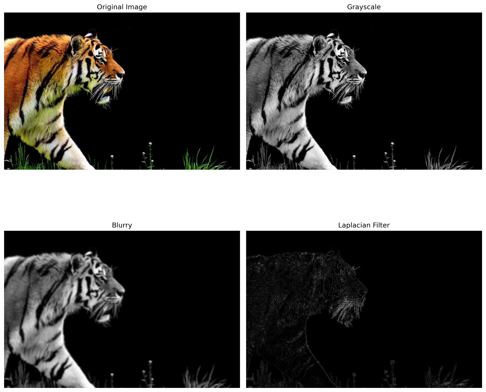

# Day 9: Laplacian Edge Detection with PyCUDA

**Objective:**
- **Revisit Day 4 Techniques:** Recalled and applied the grayscale conversion and image blurring methods learned on Day 4.
- **Edge Detection:** Developed a 2D convolutional kernel that applies a Laplacian filter to the blurred image for edge detection.
- **PyCUDA Integration:** Leveraged PyCUDA for GPU memory management, kernel execution, and data transfer, streamlining the overall workflow.

**Key Learnings:**
- **Grayscale Conversion & Blurring (Day 4 Revisited):**  
  - Converted an RGB image to grayscale using a custom kernel.
  - Applied image blurring to smooth out noise, which helps prevent the edge detection filter from capturing unwanted details.
  
- **2D Convolution & Laplacian Edge Detection:**  
  - Developed a 2D convolution kernel that applies a Laplacian filter to the blurred image.
  - This filter highlights edges by calculating second-order derivatives across the image.
  
- **PyCUDA Usage:**  
  - Managed GPU memory allocation and data transfers.
  - Loaded and invoked CUDA kernels from precompiled PTX modules.
  - Set appropriate grid and block dimensions based on the image size.
  - Enabled rapid experimentation and integration of custom CUDA kernels with Python.

**Workflow Overview:**
1. **Grayscale Conversion:** The RGB image is first converted to grayscale, simplifying the data for subsequent processing.
   
2. **Image Blurring:** The grayscale image is blurred using a custom kernel to reduce noise. This ensures that the edge detection step focuses on significant edges rather than spurious details.
   
3. **Data Type Conversion:** The blurred image is converted from integer to float format to prepare it for convolution operations.
   
4. **Laplacian Edge Detection:** A custom 2D convolution kernel applies a Laplacian filter to the blurred, float-converted image. This kernel computes the weighted sum of neighboring pixels to emphasize regions with high intensity changes (edges).
   
5. **Visualization:** The processed images (grayscale, blurred, and edge-detected) are transferred back to the host and displayed using Matplotlib, allowing for side-by-side comparison of the results.

This approach demonstrates how foundational techniques from previous days can be integrated and extended using PyCUDA to build a robust GPU-accelerated image processing pipeline.

**Laplacian Filter and Edge Detection Kernel**
```C
laplacian_filter = np.array([0, 1, 0,
                             1, -4, 1,
                             0, 1, 0],
                             dtype=np.float32).flatten()
```

```C
extern "C" __global__ void edgeDetectionLaplacianConv2D(float *input, float *output, float *filter, int img_w, int img_h) 
{
    int row = blockIdx.y * blockDim.y + threadIdx.y;
    int col = blockIdx.x * blockDim.x + threadIdx.x;

    if(row < img_h && col < img_w) 
    {
        int radius = 1;
        float val = 0.0f;
        int f_size = 2 * radius + 1;

        for(int row_f = 0; row_f < f_size; row_f++) 
        {
            for(int col_f = 0; col_f < f_size; col_f++) 
            {
                int cur_row = row - radius + row_f;
                int cur_col = col - radius + col_f;

                if(cur_row >=0 && cur_row < img_h && cur_col >= 0 && cur_col < img_w) 
                {
                    val += filter[row_f * f_size + col_f] * input[cur_row * img_w + cur_col]; 
                }
            }
        }
        output[row * img_w + col] = val;
    }
}
```

**Results:**
